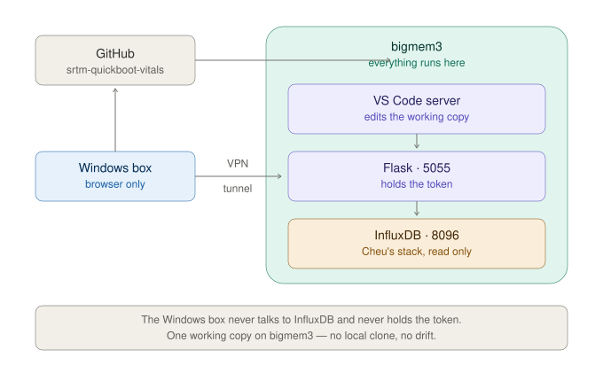

# SRTM-quick-boot-vitals

Read-only liveness dashboard for the ATLAS SRTM board. Taps an existing
Telegraf/InfluxDB/Grafana pipeline to answer one question:

> Are the numbers in the WinCC panel real, right now?

A value on a screen carries no evidence of its own freshness. A frozen board
and a healthy one both render as numbers. Everything here exists to tell those
two apart while you develop against the WinCC panels.



## It does not touch the TIG stack

Every query is a read against Prof. Cheu's production stack
(`github.com/echeu/srtm-TIG`, running on bigmem3 since 2026-05-08). Nothing is
written, no container restarted, no config edited, Grafana is not involved.

## Why there is a Flask layer

A browser cannot query InfluxDB directly -- that would put the API token into
client-side JavaScript and require a CORS exception on a container we do not
own. `app.py` holds the token and serves plain JSON.

---

## Cold start -- from nothing to the page

Six stages. Each one has a gate: a command whose output tells you it worked.
Do not move on from a failing gate -- every later symptom will be misleading.

```
   natha (Windows)                    eepp-bigmem3 (headless, 10.208.15.7)
   ---------------                    -----------------------------------

   (1) Cisco Secure Client
       vpn.arizona.edu
            |
            |  routes 10.208.x
            v
   (2) ssh ------------------------->  shell
                                         |
                                         | (3) export PATH  (de-SDK)
                                         | (4) ~/start_code_server.sh
                                         |          |
                                         |          v
                                         |     code-server  127.0.0.1:8080
                                         |
                                         | (5) ./run_vitals.sh
                                         |          |
                                         |          v
                                         |     Flask       127.0.0.1:5055
                                         |                      |
                                         |                      | reads
                                         |                      v
                                         |     InfluxDB    127.0.0.1:8096
                                         |                      ^
                                         |                      | writes
                                         |                 Telegraf --- OPC UA --> SRTM board
                                         |
   (6) ssh -L 8080 -L 5055 ---------------+
            |
            v
       browser
       localhost:8080  editor
       localhost:5055  vitals
```

Both services bind `127.0.0.1` deliberately. Neither is reachable on the
host's external interface; the SSH forward is the only way in.

### (1) VPN

`eepp-bigmem3.physics.arizona.edu` resolves to a private `10.208.15.7` and is
unreachable off-VPN. DNS still answers, so a failure here looks like a dead
host rather than a routing problem.

Cisco Secure Client, server `vpn.arizona.edu` -- **bare, no group suffix**.
NetID, password, then `push` at the 2FA prompt.

```powershell
Test-NetConnection eepp-bigmem3.physics.arizona.edu -Port 22 | Select TcpTestSucceeded
```

**Gate:** `True`.

### (2) SSH in

```powershell
ssh naherlin@eepp-bigmem3.physics.arizona.edu
```

**Gate:** a prompt, after the PetaLinux banner noise.

### (3) De-SDK the shell

The login shell sources the PetaLinux/Vitis SDK, which puts an SDK python3.10
ahead of the system python and can drop coreutils off `PATH` entirely.
Packages `pip3` installs there are invisible to the interpreter that actually
runs, so `pip3 install` succeeds and `import requests` still fails.

```bash
export PATH=/usr/local/bin:/usr/bin:/bin:/usr/local/sbin:/usr/sbin:$PATH
```

Run this in **every** new session. Then confirm the data source is alive:

```bash
docker ps --format '{{.Names}}\t{{.Status}}' | grep srtm-tig
```

**Gate:** `srtm-tig-telegraf-1` and `srtm-tig-influxdb-1` both `Up`. Grafana is
not required -- see *Known upstream defects*.

### (4) code-server

Needed for drag/drop editing on the box. **Installed by tarball and not on
`PATH`** -- a bare `code-server` fails with *No such file or directory*, and
`nohup` reports that only in the log file, so the launch looks silent.

```bash
~/start_code_server.sh
```

The binary is at `~/code-server/bin/code-server`. The script exports `PATH`,
refuses to double-start if 8080 is already listening, logs to
`~/logs/code-server.out`, and verifies the listener before returning.

**Gate:** `OK  http://localhost:8080 via tunnel`.

There is **no service unit** -- code-server does not survive a host reboot.
After one, re-run the script.

The browser will ask for a password at `localhost:8080`. It is generated at
install time, not chosen, so read it off the box:

```bash
grep -E '^(password|hashed-password|auth):' ~/.config/code-server/config.yaml
```

`auth: password` with a `password:` line -- that value is what you paste.
`auth: none` means no prompt. A `hashed-password:` instead cannot be read
back; set a new one by editing `password:` in that file and restarting
code-server.

### (5) The instrument

First time on a given clone:

```bash
git clone https://github.com/N-Herling-Mk1/SRTM-quick-boot-vitals.git
cd SRTM-quick-boot-vitals

/usr/bin/python3 -m venv .venv          # NOT bare `python3` -- see (3)
.venv/bin/pip install -r requirements.txt

mkdir -p logs                            # gitignored; absent on a fresh clone
cp .env.example .env                     # then fill in INFLUXDB_TOKEN
```

Every time:

```bash
./run_vitals.sh
```

Four gates print in order: interpreter, environment, InfluxDB reachable,
serving. It refuses to start under an SDK interpreter rather than failing
later at `import`.

**Gate:** the banner reads `cadence : 175 fields`. A different count means
telegraf's live field set has drifted from `data/cadence_stats.csv` and the
map will show grey cells.

### (6) Tunnel and open

New PowerShell window -- closing it drops both forwards. One hop carries both
ports:

```powershell
ssh -L 8080:localhost:8080 -L 5055:localhost:5055 naherlin@eepp-bigmem3.physics.arizona.edu
```

| URL | what |
|---|---|
| `http://localhost:8080` | code-server -- editing, drag/drop |
| `http://localhost:5055` | the vitals page |

**Gate:** the cadence map is coloured rather than all grey, `t_poll` ticks, and
`IPMC_seq` / `IPMC_rawtime` / `IPMC_time` advance in the canary strip.

### After a reboot

Nothing here is a service. `~/start_code_server.sh` and `./run_vitals.sh` both
have to be re-run by hand. Telegraf and InfluxDB come back on their own;
Grafana does not.

### Getting files onto bigmem3

`scp`/`sftp`/`rsync` **do not work into this host** -- the login shell prints
PetaLinux banners on non-interactive sessions, which corrupts the handshake
(`Received message too long`). Use `git clone`, VS Code Remote-SSH, or
code-server drag/drop.

---

## What the page shows

### Cadence map

One cell per channel, coloured by **how often that channel changes**. It is a
taxonomy, not an alarm: red means "rarely changes", not "broken". A serial
number that never changes is red, and that is correct. Nothing blinks.

| colour | median gap between value changes |
|---|---|
| green | <= 30s |
| yellow | 30s - 5m |
| orange | 5m - 24h |
| red | > 24h, incl. channels that never changed during measurement |
| grey | not measured -- run `tools/collect_cadence.py` |

Edges were cut from the measured distribution, not chosen in advance. Both
land in empty regions, so nothing sits near a boundary:

```
52 ch @ 5s | 10 @ 10s | 6 @ 15-25s | (void) | 4 @ 35-85s | (void) | 3 @ 7200s
                                             ~90 with no change in 24h
```

Clicking a cell isolates that channel in the grid below and opens its detail
view; closing the detail restores the full grid. Each channel card carries the
same colour as a thin outline.

Override the edges without editing code: `VITALS_CAD_GREEN`,
`VITALS_CAD_YELLOW`, `VITALS_CAD_ORANGE` (seconds).

### The 5-second floor

Telegraf polls every 5 seconds. That is the fastest change this data can
express -- a rail jittering every 200ms and one changing every 4.9s are
indistinguishable. Roughly a third of all channels sit at exactly 5.0s for
that reason.

### Three clocks

| clock | measures | catches |
|---|---|---|
| `t_poll` | since the collector last wrote | dead pipeline, VPN drop, stopped container |
| `t_change` | since a value last differed | frozen board, wedged OPC UA server |
| `t_wincc` | since the WinCC DP last changed | **mk_1, not yet wired** |

`t_poll` alone is not enough: Telegraf writes on a 5s schedule whether or not
the value moved, so a frozen board produces a healthy-looking timer forever.

The header lamp reports `t_poll` **and nothing else**. It makes one claim --
the collector is or is not writing -- and no judgement about the board.

### Canaries

Monotonic counters only ever count upward, so one that stops advancing is
unambiguously frozen. Most channels cannot do this job: a voltage rail may sit
flat and be perfectly healthy.

They are **not equally useful**. Measurement showed `FF11/12/13_uptime` tick
only every 7200s -- exactly two hours -- so they cannot detect a freeze for up
to two hours. Only canaries whose measured cadence falls in the green bin
drive the `t_change` clock; on this board that is `IPMC_seq`, `IPMC_rawtime`
and `IPMC_time`. The slow ones still appear in the strip.

### Detail view

Click any channel. Time-series plot with selectable window (30m to 7d), plus:

* **value statistics** -- current, mean, sigma, min, max, `t_change`
* **change rhythm** -- number of changes, and mean / sigma / median / min /
  max of the *interval between changes*, over the same window
* **24h reference cadence** -- bin, median, mean, p10, p90, burstiness, n

Value sigma and gap sigma are kept separate on purpose: one measures
magnitude, the other rhythm. Sigma of the value is displayed and never
alarmed -- sigma = 0 is equally consistent with a frozen channel, a genuinely
quiet rail, or one quantised coarser than its real noise.

Press `?` or the HELP button for the in-page glossary of every recorded
quantity.

---

## Measuring cadence

`data/cadence_stats.csv` is generated, committed, and read at startup.
Re-run after a `telegraf.conf` change or a long outage -- not on a schedule.

```bash
set -a; . .env; set +a
nohup .venv/bin/python tools/collect_cadence.py > logs/collect.out 2>&1 &
disown
tail -f logs/collect_cadence.log
```

About 14 minutes for a 1-day window over 165 numeric fields. Detach it --
a dropped SSH connection otherwise kills the run.

It measures the **distribution of gaps between consecutive value changes**
(`difference` -> `elapsed` -> quantiles, all server-side), not just a count.
A mean would hide burstiness: a channel that flips 500 times in a minute then
sits dead for a day has the same mean interval as one ticking steadily every
three minutes. `burstiness` (p90/median) separates them.

`--deep-days` defaults to **0**. Enabling it over every low-count field pulls
in all the DISCRETE flags and retired SPI channels -- 100+ fields, ~3 hours,
to measure things that rarely change by design. Point it at a short explicit
list when a specific slow channel matters.

---

## Repo layout

```
app.py                        Flask: reads .env, serves JSON + the page
run_vitals.sh                 launcher; guards against the SDK python
templates/index.html          page + glossary
static/vitals.css             TRON-light panels on a black field
static/vitals.js              polling, search, map, detail plot
data/node_classification.csv  161 fields: COUNTER/ANALOG/DISCRETE/STATIC
data/cadence_stats.csv        measured change cadence, 175 fields
tools/collect_cadence.py      regenerates the above
logs/                         gitignored, absent on a fresh clone -- mkdir -p it
docs/topology.svg             how the pieces connect
```

## Known upstream defects (echeu/srtm-TIG)

* `.env` is committed with a live admin-scoped InfluxDB token in a public
  repo. Generate your own read-scoped token; do not reuse that one.
* All three images are `:latest`.
* `SRTM.FF11_cdrlol` and `SRTM.FF12_cdrlol` publish as fields `F11_cdrlol`
  and `F12_cdrlol` -- missing an F. `FF13_cdrlol` is correct. Confirmed in
  live InfluxDB data, not just the config. Any grouping across the three
  FireFlys silently drops two of three.
* README says browse `localhost:8086`; the host mapping is `8096`.
* **`grafana` has `restart: no`** while `telegraf` and `influxdb` have
  `unless-stopped`. bigmem3 rebooted 2026-08-04 ~02:00 UTC; docker reconciled
  at 02:30 and brought back two of three. Grafana's `rc=255` and its stale
  `StartedAt` are artifacts of the daemon dying underneath it, not a fault.
  One line in `compose.yaml` fixes it. The outage also leaves a multi-hour
  hole in InfluxDB across Aug 3-4 -- a window selected across it shows a flat
  line that is not a frozen channel.

## Open

* **`t_wincc`** needs a WinCC OA CTRL manager or an RDB query. The expensive
  half, and the reason it is not in mk_0.
* **15 unclassified fields** exist in InfluxDB but not in
  `node_classification.csv`: `SRTM_SPI00`-`SRTM_SPI13` (retired config) and
  `Quality`. `Quality` is Telegraf's per-read OPC UA **StatusCode** -- a
  direct health signal from the server that nothing currently looks at.
* **37 ANALOG channels never changed in 24h.** All three FireFlys report
  `present = 1` with distinct temperatures, so the hardware is there; the
  likely explanation is 1 degC quantisation coarser than the real variation.
* **Cadence measured against one 24h window.** If the board misbehaved during
  it, that behaviour became the reference. Re-measure against a period known
  to be clean.
